# training-platform

[](https://github.com/kalw/training-platform/actions/workflows/ci.yml)
[](https://github.com/kalw/training-platform/releases/latest)
[](go.mod)
[](https://goreportcard.com/report/github.com/kalw/training-platform)
[](https://github.com/kalw/training-platform/pkgs/container/training-platform)
[](docs/DEPLOY.md)

A self-hosted, Katacoda-style hands-on training platform as **one Go
binary**, deployed **only on Kubernetes**: Markdown lessons with live
in-browser Docker terminals, quizzes and exercises graded server-side, and a
class scoreboard.



- **One binary, one image** — lessons site, session engine, terminals,
  scoring, exposed-port router and a Docker-Engine-API shim, replacing a
  six-repo / three-language stack (Go console fork, JS SDK, patched CTFd,
  Jekyll plugins, Ansible, Helm)
- **Real sandboxes** — each learner gets privileged DinD Pods; they type
  `docker` commands in an xterm.js terminal bridged to `pods/exec`
- **Honest grading** — quiz answers only ever leave the page as salted
  hashes; exercises are verified **server-side** by fetching the learner's
  own service (or by perceptual-hash screenshot proof for visual results)
- **No database** — challenges re-seed from the build at boot; solves persist
  in an append-only JSON-lines log on a tiny PVC
- **Session hygiene** — idle sessions are garbage-collected minutes after
  the tab closes; a hard TTL bounds everything

## Install

The Helm chart is published to GHCR alongside the image:

```sh
helm install training oci://ghcr.io/kalw/charts/training-platform --version 0.1.0 \
  --namespace training --create-namespace \
  --set serve.salt="$CTFD_SALT" --set persistence.enabled=true
```

See [docs/DEPLOY.md](docs/DEPLOY.md) for ingress, RBAC and the values that
matter.

## Quickstart (hacking on it)

With a [kind](https://kind.sigs.k8s.io) cluster and this repo, the whole
loop is four make targets:

```sh
kind create cluster --name training

make dev-deploy     # build image + kind load + render lessons + helm install
make dev-forward    # open http://localhost:8080
```

Write a lesson in Markdown, and the build renders the page **and** registers
its challenges in the same pass:

```markdown
---
title: Containers — quiz
image: busybox:1.36            # boots the learner's session Pod
---
# Listing containers


Which command lists the running containers?
- [x] docker ps
- [ ] docker ls

```

```sh
training build --src lessons --out site --salt "$CTFD_SALT"
training serve --lessons-dir site --challenges-file site/challenges.json \
               --solves-file solves.jsonl
```

Exercises boot a deliberately broken image the learner must repair, and are
graded by the platform **fetching the learner's own service** and asserting
its content — the browser can't fake it:

```yaml
image: ghcr.io/kalw/my-broken-nginx:latest
exercise_expect: "The service is running correctly"
```

## What's in the binary

| Surface | Package | What it does |
|---|---|---|
| **Session engine** | `internal/session` | Kubernetes-native sandboxes: instances are privileged Pods; idle + hard TTL GC |
| **Terminals** | `internal/terminal` | Browser WebSocket ⇄ `pods/exec` (SPDY), with TTY resize |
| **Scoring** | `internal/scoring` | Hash contract, server-side content verification, phash screenshot grading, durable solve log, standings |
| **Router** | `internal/router` | Exposed-port routing: `ip<A-B-C-D>-<id>-<port>.<host>` → Pod IP, in-cluster |
| **Docker shim** | `internal/dockershim` | A subset of the Docker Engine API backed by Kubernetes — Docker tooling keeps working |
| **Content** | `internal/content` | `training build`: Markdown + ``/`` → HTML + `challenges.json`, one pass |
| **Lessons / Auth** | `internal/lessons`, `internal/auth` | Static site serving; GitHub/Google login, or per-browser random learner names |

## Documentation

| Doc | What's in it |
|---|---|
| [WRITING-LESSONS.md](WRITING-LESSONS.md) | **Authoring**: front matter, Markdown subset, terminals, `.termN` blocks, port links, quizzes, exercises, grading choice |
| [docs/SCORING.md](docs/SCORING.md) | Grading in depth, the proof client, durable solves, learner identity |
| [docs/RUNTIME.md](docs/RUNTIME.md) | The lesson page at runtime: session lifecycle, keepalive/GC, routing, legacy parity, vendored assets |
| [docs/DEVELOPMENT.md](docs/DEVELOPMENT.md) | Build, test (unit + Playwright e2e), the kind/k3s dev loop |
| [docs/DEPLOY.md](docs/DEPLOY.md) | The Helm chart: ingress, RBAC, persistence, security posture |
| [DESIGN.md](DESIGN.md) | Why one binary; the proven primitives it's built on |
| [K8S-SANDBOX-DESIGN.md](K8S-SANDBOX-DESIGN.md) | The shim/router experiments behind the design |
| [MIGRATION.md](MIGRATION.md) | Consolidation status of the six legacy repos, and what's deliberately out of scope |

## Contributing

```sh
make test                                    # go vet + race tests
docker build -f e2e/Dockerfile -t training-e2e . && docker run --rm training-e2e
```

Pure Go, no cgo; the e2e suite is Playwright, fully self-contained in Docker.
See [docs/DEVELOPMENT.md](docs/DEVELOPMENT.md).
